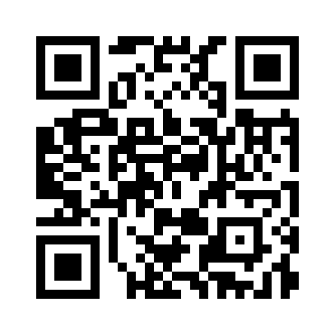
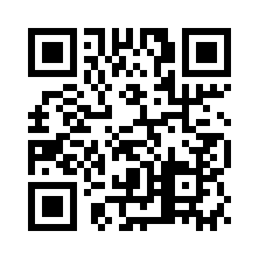
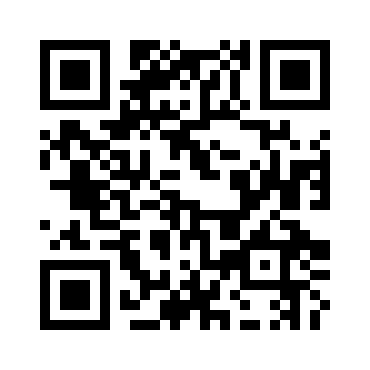
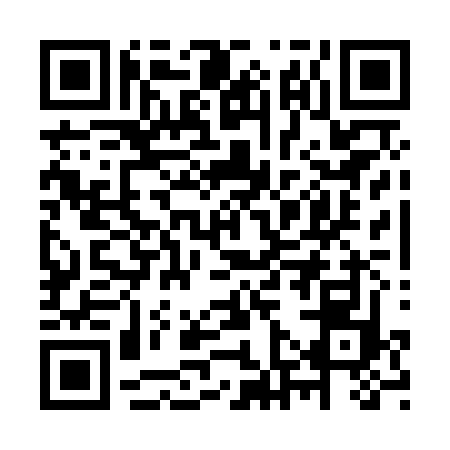
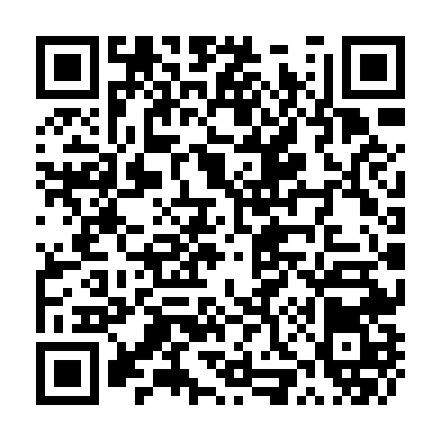

# UAE Commemorative Coin Project - QR Codes Summary

This document provides an overview of all generated QR codes for the UAE Commemorative Coin Project.

## Generated QR Codes

### Emirate 1 (Abu Dhabi) - Live at minting

**Destination URL:** `https://u.ae/abudhabi`

**Files Generated:**
- PNG: `/home/runner/work/Activbot/Activbot/uae_coin_project/qr_codes/emirate1_abudhabi_qr.png`
- SVG: `/home/runner/work/Activbot/Activbot/uae_coin_project/qr_codes/emirate1_abudhabi_qr.svg`

**QR Code Preview (PNG):**

---

### Emirate 2 (Dubai) - Live at minting

**Destination URL:** `https://u.ae/dubai`

**Files Generated:**
- PNG: `/home/runner/work/Activbot/Activbot/uae_coin_project/qr_codes/emirate2_dubai_qr.png`
- SVG: `/home/runner/work/Activbot/Activbot/uae_coin_project/qr_codes/emirate2_dubai_qr.svg`

**QR Code Preview (PNG):**

---

### Falcon Eye - Cultural Heritage

**Destination URL:** `https://u.ae/culture`

**Files Generated:**
- PNG: `/home/runner/work/Activbot/Activbot/uae_coin_project/qr_codes/falcon_eye_culture_qr.png`
- SVG: `/home/runner/work/Activbot/Activbot/uae_coin_project/qr_codes/falcon_eye_culture_qr.svg`

**QR Code Preview (PNG):**

---

### Project Web Page

**Destination URL:** `https://github.com/ELMOURABEA/Activbot`

**Files Generated:**
- PNG: `/home/runner/work/Activbot/Activbot/uae_coin_project/qr_codes/project_webpage_qr.png`
- SVG: `/home/runner/work/Activbot/Activbot/uae_coin_project/qr_codes/project_webpage_qr.svg`

**QR Code Preview (PNG):**

---

### Project Documentation

**Destination URL:** `https://github.com/ELMOURABEA/Activbot/blob/main/README.md`

**Files Generated:**
- PNG: `/home/runner/work/Activbot/Activbot/uae_coin_project/qr_codes/documentation_qr.png`
- SVG: `/home/runner/work/Activbot/Activbot/uae_coin_project/qr_codes/documentation_qr.svg`

**QR Code Preview (PNG):**

---

### Downloadable 3D Model and Assets

**Destination URL:** `https://github.com/ELMOURABEA/Activbot/releases`

**Files Generated:**
- PNG: `/home/runner/work/Activbot/Activbot/uae_coin_project/qr_codes/downloadable_3d_model_qr.png`
- SVG: `/home/runner/work/Activbot/Activbot/uae_coin_project/qr_codes/downloadable_3d_model_qr.svg`

**QR Code Preview (PNG):**

---

## Usage Instructions

### Embedding in Documents

#### For PDF Documents
Use the PNG format files for embedding in PDF documents.

#### For Web Pages
Use the SVG format files for crisp rendering on web pages at any scale.

#### For Print Materials
Use the PNG files with high DPI settings (300+ DPI recommended for professional printing).

### Scanning QR Codes

QR codes can be scanned using:
- Smartphone camera apps (most modern phones have built-in QR scanning)
- Dedicated QR code scanner apps
- Web browsers with QR scanning features

## Technical Details

- **Error Correction Level:** High (H) - 30% of codewords can be restored
- **Format:** PNG (raster) and SVG (vector)
- **Border Size:** 4 modules (standard QR code quiet zone)
- **Color Scheme:** Black on white for maximum contrast and readability

